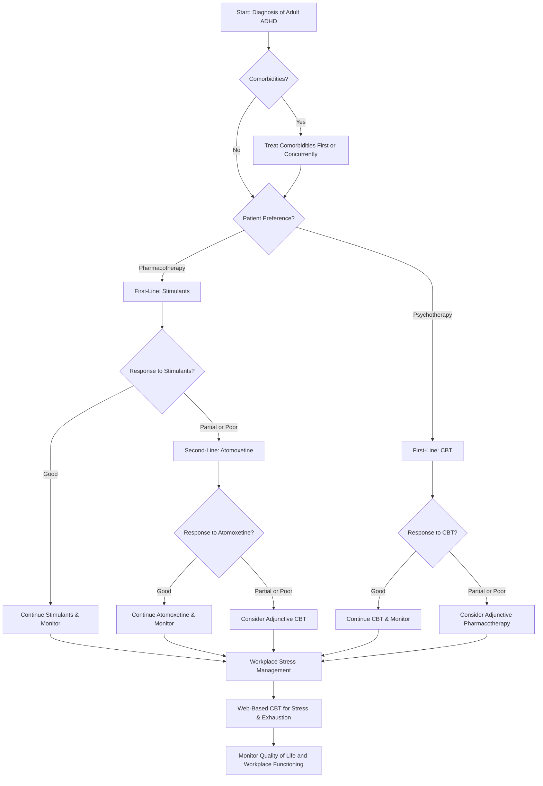

# Adult ADHD Treatment Decision Tree for Professional Men (25-55)

This decision tree provides a evidence-based pathway for selecting treatments for professional men with ADHD, based on the latest research.

## Treatment Principles

*   **Shared Decision-Making:** Treatment decisions should be made in collaboration with the patient, considering their preferences, values, and goals.
*   **Multimodal Approach:** A combination of medication and psychotherapy is often the most effective approach.
*   **Workplace Focus:** Treatment should address the specific challenges faced by professional men in the workplace, such as stress, burnout, and executive function deficits.
*   **Regular Monitoring:** Treatment progress should be regularly monitored using validated rating scales and measures of workplace functioning.

